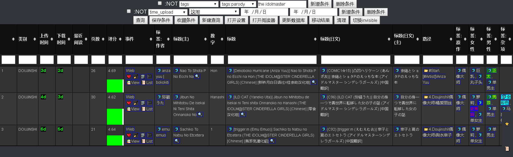
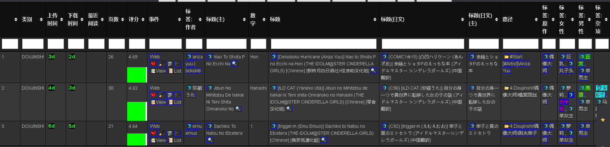

### 使用说明

1. 有一大堆从E站，使用[E-Hentai-Downloader](https://github.com/ccloli/E-Hentai-Downloader)下载的本子
2. 安装MySQL
3. `yarn add` 或 `npm install`
4. `yarn global add electron` 或 `npm install electron --global`
5. `npm run start` 或 `electron ./main.js`
6. 首次使用自动打开设置页面，设置好MySQL的信息(host,user,password,database)，设置存放本子的路径(libraryFolder)
7. 点击`Init`，之后点击`Update`（注意：未优化主线程，如果本子过多，会假死较长时间，请耐心等待）
8. 完成后返回，可以开始使用

### 查询页面使用技巧

##### 预览

##### 条件筛选

**写这个程序的目的就是筛选出想看的本子**

各个输入框说明如下：
  1. 是否
    如文本*:NOT*所示，勾选时，将过滤掉符合条件的本子
  2. 筛选类别
  3. 比较符
  4. 输入框1
  5. 输入框2 （当*项目2*与时间相关时，显示，仅用于BETWEEN...AND筛选）

**注意**：
  1. 当筛选类别为*command*时，直接向数据库查询输入MySQL语句，此时非类型*command*的条件将被忽略，所有类型*command*的条件同时查询
  2. 当筛选类别为*tags*时，输入框1内容匹配`^/.*/$`时，使用正则表达式查询标签
  3. 当筛选类别为*tags*时，输入框1内容匹配`^[><]?=\d+$`时，检测标签的长度(JSON_LENGTH)

##### 按钮

* 查询
* 保存条件
  保存该条件，当设置*记住上次条件*时，每次打开查询都会复原该条件
  注意：点击查询时，也会保存条件
* 收藏条件
  收藏该条件，与保存条件不同的是，它会被列举在侧边栏（更多信息看*侧边栏*）
* 新建查询
  打开新的查询窗口
* 打开设置
  打开设置窗口
* 打开阅读器
  打开阅读器窗口
* 更新数据库
  等同于设置窗口的`Update`
* 移动结果
  移动查询到的本子到指定文件夹（此后需手动更新数据库）
* 清理
  删除store.json内不重要的信息
  当然你也可以直接删除文件store.json
* 切换invisible
  显示或隐藏设置为invisible的本子（更多信息看*结果*）

##### 结果

排序，进一步筛选，分页都是依靠成熟的第三方库*jquery.tablesorter*完成，不做介绍

主要介绍一下按钮（蓝框包围，Emoji图标）

* Web 打开本子的原网址（本想使用地球的emoji）
* ❤️/🖤 红心收藏（高亮收藏行），黑心取消收藏（此外无其他作用，信息储存在store.json/star）
* 🧹 清理，清理与该本子有关的信息，如是否收藏，上次阅读时间，阅读位置
* 🗑️ 删除，本地移除本子（此后需手动更新数据库）
* 🏴 隐藏，设置或取消设置为invisible（当你不想看某些本子，但又不想删除时很有用）
* 📚View 阅读，与📜List不同的是，阅读时切换本子以路径为主
* 📜List 阅读，与📚View不同的是，阅读时切换本子以此时的查询结果为主
  eg: 筛选出本子[a,b,c]，而a所在路径下还有本子[a1,a2]
    使用📚View时，切换下一本本子，阅读a1
    使用📜List时，切换下一本本子，阅读b
    当使用排序功能时，如从[a,b,c]排序成[b,a,c]，使用📜List时，切换下一本本子，阅读c
* 🐬 查询相关的本子（MySQL图标为海豚）
* 🔍 搜索，本地搜索（需设置*Everything路径*）
* 📁 打开本子所在路径

##### 侧边栏

* ⭐ 收藏的查询条件
* 📜 历史（需设置*记录历史*）

##### index.js

由于懒，所以很多可以自定义的设置并没有显示在设置页面，
而是需要你手动打开文件[src/index.js](./src/index.js)，
搜索*// 可自定义*，并进行相关设置

### 阅读页面使用技巧

##### 中间最上方

鼠标移动到此会显示当前信息

##### 中间最左、最右

鼠标移动到此会显示翻页按钮

##### 中间最下方

鼠标移动到此会显示进度条

##### 右下方

鼠标移动到此会显示预览框，点击会跳转到指定位置

##### 中间

本子内容，点击会滚动指定高度

##### 快捷键

按*F1*，显示帮助，不在此说明
注意：全局通用的快捷键指在查询页面也可使用

##### viewer.js

由于懒，所以很多可以自定义的设置并没有显示在设置页面，
而是需要你手动打开文件[src/viewer.js](./src/viewer.js)，
搜索*// 可自定义*，并进行相关设置
